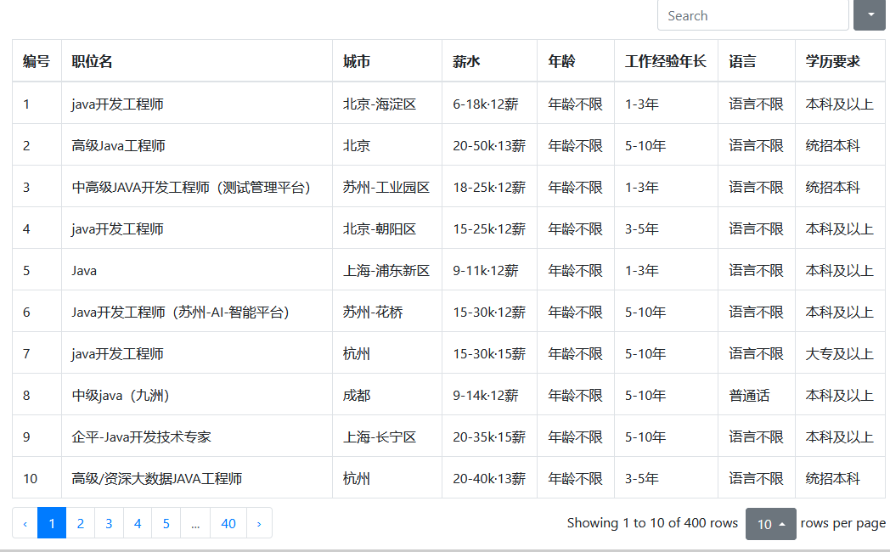

## 1.本项目基于Python作为爬虫技术，使用flask作为web项目的开发框架。

## 2.本项目预期实现的功能有：

### 	2.1简单的web页面展示，将需要搜索的结果使用词云，饼状图，柱状图以及表格这四种形式表现出来。

## 	2.2输入关键字后搜索后能根据搜索结果智能推荐最合适的职位。

### 	2.3支持多条件复杂查询，结合行业，所选城市进行综合查询。

### 	2.4通过手动添加新词进行过滤词云内容达到更加精确人性化的结果。

## 3.使用的技术有：

### 	3.1前端

####     	 3.1.1页面：HTML+CSS+JavaScript+JQuery

#### 		 3.1.2前端框架：boostrap 

#### 		 3.1.3前端插件： echarts（用于将结果渲染程柱状图和饼状图）+dispicker(显示省市区便于选择地区) + smart-zoom（将词云图进行放大）+boostrap-Table（对爬取的职位信息展示在表格中）

### 	3.2后端

#### 		 3.2.1 基于flask的web框架

#### 		 3.2.2jieba用于处理分析搜索到的岗位要求以及描述然后利用wordcloud进行生成词云

#### 		 3.2.3使用BeautifulSoup对获取的网站源代码进行提取想要的内容。

#### 3.2.4自己手写实现返回的数据类型。

#### 3.2.5使用多线程进行爬取数据，每页数据40个职位，共十页，使用十个线程进行同时爬取缩短爬取时间，但是同时对计算机的性能提出了更高的要求。

​			

## 4.目前实现的功能

#### 4.1通过关键字搜索获取文本后经过处理生成词云然后在页面中显示出词云以及对应数据的柱状图和饼状图直观看到不同要求的差异。

#### 	4.2已在页面中写好省市区的视图页面但是查询**<u>尚未支持所有地区查询（尚未匹配好省市区的编码）目前只支持十二个主要大城市查询，具体在static/json/cityMapingJson.json文件中有。后期可以手动添加新的城市以及对应的编码即可，不需要修改代码即可动态加载。**</u>

#### 	4.3本项目的图片URL，文件的URL，词云图片的URL，过滤词组，添加的新词组，每个爬取标签的唯一选择器selector文本均已经写成json格式的配置文件放在项目中。当项目启动时会自动加载这些数据，并且支持手动实时更新这些json配置信息的内容而对不需要重新启动项目。比如如要进行更加精确的过滤词汇，只需要在fileAndImgPro.json中配置**ignoreWords**和newWords的对应值即可。

#### 4.4目前已实现将每个工作的具体信息爬取封装好并以json格式返回给前端页面用于Table表格的渲染。

#### 4.5对工作第一个版本尚未进行精准的文本过滤，目前只是很笨拙的分析提取。更精确的结果敬请期待下一个版本。

## 5.配置文件

### 5.1urlSettingPro.json的配置

  

```
{
  "url": "https://www.liepin.com/",
  "searchUrl":"https://www.liepin.com/zhaopin/",
   "jobInfoLinkDiv": {"name1":".job-info h3 a"},
   "jobNameDiv": {"name1": "div.title-info > h1"},
    "jobCompanyNameDiv": {"name1": "div.title-info > h3 a"},
   "jobSalaryDiv": {
     "name1": ".job-item-title",
     "name2": ".job-main-title",
     "name3": ".job-title-left"
   },
  "jobCityDiv": {
    "name1":"div.job-title-left > p.basic-infor > span > a"
    },
   "jobEduDiv": {
    "name1":"div.job-title-left > div > span:nth-of-type(1)"
    },
   "jobExperienceTimeDiv": {
    "name1":"div.job-title-left > div > span:nth-of-type(2)"
    },
   "jobCodeNameDiv": {
    "name1":"div.job-title-left > div > span:nth-of-type(3)"
    },
   "jobAgeDiv": {
    "name1":"div.job-title-left > div > span:nth-of-type(4)"
    },
  "jobDesDiv": {
    "name1":"div.job-item.main-message.job-description > div",
    "name2": "div.job-main.job-description.main-message > div"
  },
  "pageCount": 10,
  "pageSize":80
}
```

配置项的含义：

```
   "url":需要爬取的网站首页URL。
   “searchUrl”：具体搜索职位时需要发送请求的目标URL
   "jobInfoLinkDiv":job详细信息的链接的selector。
   "jobNameDiv":工作名称标签的selector，由于是动态的所以可能导致不同的job的信息源代码中jobName标签的selector有对个，那么就配置多项。如下内容均是一样。
    "jobCompanyNameDiv": {"name1": "div.title-info > h3 a"},
   "jobSalaryDiv": 源码中工作薪水的选择器，有多个就配置多个
  "jobQualificationsDiv":源码中多个要求的标签的选择器
  "jobDesDiv": 源码中工作描述或者要求的选择器
  "jobAgeDiv":源码中年龄标签的选择器。
  "pageCount": 网站中工作职位的页数。猎聘网默认是十页,
  "pageSize":默认每页的数据

  
```

比如：在某一个工作中，


jobDesDiv的标签的selector在源代码中的位置为：


“div.job-main.job-description.main-message > div”能够唯一确定其位置。

但是在另一个工作页面中

它在源码中的选择器selector就是另外一个了：


因此jobDesDiv就有两个选择器selector，那么它的配置方法就是：

 "jobDesDiv": {
    "name1":"div.job-item.main-message.job-description > div",
    "name2": "div.job-main.job-description.main-message > div"
  }

### 5.2fileAndImgPro.json的配置

```
{

   "wordCloudImg_small":"static/img/small.jpg",
   "wordCloudBgImg":"static/img/wordCloudBg.png",
   "ignoreWords":"[\",\"\".\"\"。\"\"?\"\"？\"\"’\"\"‘\"\"'\"\"”\"\"“\"\"【\"\"】\"\"{\"\"}\"\"｛\"\"｝\"\"：\"\":\"\"、\"\"任职要求\"\"任职要求1\"\"职位描述\"\"职位描述1\"\"岗位职责\"\"工作职责\"\\d]",
   "textFilePathDir": "static/file",
   "newWords": "[{\"word\":\"天天学习\",\"freq\":4},{\"word\":\"机器学习\",  \"freq\":3},{\"word\":\"数据挖掘\",\"freq\":5},{\"word\":\"熟悉算法\",\"freq\":4}]"
}
```

**wordCloudImg_small**：前端页面中词云图片的URL地址

**wordCloudBgImg**：在生成词云时的背景图片的URL

**ignoreWords**：在岗位描述或者岗位要求职责中需要过滤的词语或符号，该表达式必须是 **<u>正则表达式</u>**

newWords：在jieba库进行精确拆分提取文本内容得到每个词语的出现频率时，手动添加新的词语使得jieba在分析时识别出文本中含有的这个词语不被拆分。使用json数据格式进行添加，其中，｛“word”: 词语,"freq": 正整数值｝是一个json对象，word对应的是添加的词语，freq对应的是出现的频率。

**textFilePathDir：**多线程爬取数据时，爬取数据时每个线程爬出的数据保存到一个文件中，然后这个文件保存到该文件夹下；单线程爬取数据时所有的工作对象信息保存到一个json文件中去，岗位要求则保存到一个txt文件中去。

### 5.3文件命名

#### 5.3.1单线程时生成的文件命名为：

​		保存工作对象信息的json文件为名为： “搜索文本_区域编码.json",岗位要求信息的txt文件名为：“搜索文本 _ 区域编码 .txt”。比如搜索文本为 “算法工程师”，地区为北京市，其对应的区域编码为010，则会生成两个文件

“算法工程师_010.json”和“算法工程师 _ 010.txt”.其它依次类似。

#### 5.3.2多线程时生成的文件命名为：

​	使用多线程爬取数据时是分为十页，每一页数据都用一个线程来爬取。每一页的数据中工作信息对象集合保存到一个json文件中去，其格式为 “搜索文本_区域编码 _ 页码.json"，工作的要求和描述保存到一个txt文件中去，其格式为“搜索文本 _ 区域编码 _ 页码.txt".比如搜索文本为 “算法工程师”，地区为北京市，其对应的区域编码为010，则会生成十个json文件，十个txt文件。

“算法工程师 _ 010 _0.json”和“算法工程师 _ 010 _ 0.txt”;

“算法工程师 _ 010 _1.json”和“算法工程师 _ 010 _ 1.txt”;

“算法工程师 _ 010 _2.json”和“算法工程师 _ 010 _ 2.txt”;

........

“算法工程师 _ 010 _9.json”和“算法工程师 _ 010 _ 9.txt”;


## 6.效果图




